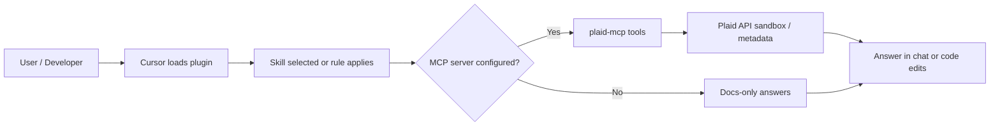

<p align="center">
  
</p>

<h1 align="center">Plaid Developer Tools</h1>

<p align="center">
  <strong>Cursor plugin and MCP companion for building on Plaid</strong>
</p>

<!-- Row 1: Identity -->
<p align="center">
  <a href="https://github.com/TMHSDigital/Plaid-Developer-Tools/releases"></a>
  <a href="https://github.com/TMHSDigital/Plaid-Developer-Tools/releases"></a>
  <a href="LICENSE"></a>
  <a href="https://tmhsdigital.github.io/Plaid-Developer-Tools/"></a>
</p>

<!-- Row 2: CI -->
<p align="center">
  <a href="https://github.com/TMHSDigital/Plaid-Developer-Tools/actions/workflows/ci.yml"></a>
  <a href="https://github.com/TMHSDigital/Plaid-Developer-Tools/actions/workflows/validate.yml"></a>
  <a href="https://github.com/TMHSDigital/Plaid-Developer-Tools/actions/workflows/codeql.yml"></a>
</p>

<!-- Row 3: Community -->
<p align="center">
  <a href="https://github.com/TMHSDigital/Plaid-Developer-Tools/stargazers"></a>
  <a href="https://github.com/TMHSDigital/Plaid-Developer-Tools/issues"></a>
</p>

<p align="center">
  <strong>17 skills</strong> &nbsp;&bull;&nbsp; <strong>7 rules</strong> &nbsp;&bull;&nbsp; <strong>30 MCP tools</strong>
</p>

<p align="center">
  <a href="#skills">Features</a> &nbsp;&bull;&nbsp;
  <a href="#rules">Rules</a> &nbsp;&bull;&nbsp;
  <a href="#mcp-tools">MCP tools</a> &nbsp;&bull;&nbsp;
  <a href="#installation">Install</a> &nbsp;&bull;&nbsp;
  <a href="#configuration">Config</a> &nbsp;&bull;&nbsp;
  <a href="#roadmap">Roadmap</a>
</p>

---

## Overview

Plaid Developer Tools is a **Cursor** plugin by **TMHSDigital** that packages agent skills, editor rules, and a TypeScript **MCP server** (`mcp-server/`) so you can design, debug, and ship Plaid integrations without leaving the IDE. Production coverage today is **v0.6.0** with fourteen skills, seven rules, and twenty-eight live MCP tools; the rest are staged stubs with version targets on the [roadmap](ROADMAP.md).

<table>
<tr>
<td width="50%">

**What you get**

| Layer | Role |
| --- | --- |
| **Skills** | Guided workflows: Link, `/transactions/sync`, webhooks, sandbox, categories, errors, and future topics |
| **Rules** | Guardrails: `plaid-secrets`, `plaid-error-handling`, `plaid-env-safety`, and upcoming checks |
| **MCP** | Thirty tools (28 live, 2 stubs) for institutions, items, balances, sync, investments, identity, webhooks, and more |

</td>
<td width="50%">

**Quick facts**

| Item | Detail |
| --- | --- |
| **License** | [CC-BY-NC-ND-4.0](LICENSE) |
| **Author** | [TMHSDigital](https://github.com/TMHSDigital) |
| **Repository** | [github.com/TMHSDigital/Plaid-Developer-Tools](https://github.com/TMHSDigital/Plaid-Developer-Tools) |
| **Runtime** | Node 20+ for MCP server builds |

</td>
</tr>
</table>

### How it works



<details>
<summary><strong>Expand: end-to-end mental model</strong></summary>

1. Install the plugin (symlink into your Cursor plugins directory).
2. Open a Plaid-related task; **rules** such as `plaid-secrets` and `plaid-env-safety` run as you edit.
3. Invoke a **skill** by name (for example `plaid-link-setup` or `plaid-transaction-sync`) when you need a structured workflow.
4. Optionally wire **MCP** so tools like `createLinkToken`, `syncTransactions`, or `verifyWebhookSignature` can call the in-repo server against your credentials.

</details>

---

## Compatibility

| Client | Skills | Rules | MCP server (`mcp-server/`) |
| --- | --- | --- | --- |
| **Cursor** | Yes (native plugin) | Yes (`.mdc` rules) | Yes, via MCP config |
| **Claude Code** | Yes, copy `skills/` | Yes, copy `rules/` | Yes, any MCP-capable host |
| **Other MCP clients** | Manual import | Manual import | Yes, stdio or hosted adapter |

---

## Quick start

**1. Clone**

```bash
git clone https://github.com/TMHSDigital/Plaid-Developer-Tools.git
cd Plaid-Developer-Tools
```

**2. Symlink the plugin (pick your OS)**

Windows PowerShell (run as Administrator if your policy requires it):

```powershell
New-Item -ItemType SymbolicLink `
  -Path "$env:USERPROFILE\.cursor\plugins\plaid-developer-tools" `
  -Target (Get-Location)
```

macOS / Linux:

```bash
ln -s "$(pwd)" ~/.cursor/plugins/plaid-developer-tools
```

Adjust the target path to your actual clone location.

**3. Build the MCP server**

```bash
cd mcp-server
npm install
npm run build
```

**4. Environment**

Copy `.env.example` to `.env` and set `PLAID_CLIENT_ID`, `PLAID_SECRET`, and `PLAID_ENV` (see [Configuration](#configuration)).

<details>
<summary><strong>Example: reference a skill in chat</strong></summary>

Ask the agent to follow **`plaid-webhook-handling`** when implementing webhook routes, or **`plaid-sandbox-testing`** when you need sandbox institutions and error simulation patterns.

</details>

---

## Skills

14 of 17 skills are production-ready. Names match the folder under `skills/`.

<details>
<summary><strong>All 17 skills</strong></summary>

| Skill | Status | Summary |
| --- | --- | --- |
| `plaid-link-setup` | :white_check_mark: Live | Plaid Link integration with `react-plaid-link` |
| `plaid-transaction-sync` | :white_check_mark: Live | `/transactions/sync` cursor-based pagination |
| `plaid-webhook-handling` | :white_check_mark: Live | Webhook types, verification, sandbox firing |
| `plaid-sandbox-testing` | :white_check_mark: Live | Sandbox credentials, test institutions, error simulation, MCP automation |
| `plaid-category-mapping` | :white_check_mark: Live | Personal finance category taxonomy |
| `plaid-error-handling` | :white_check_mark: Live | Error codes, detection, recovery |
| `plaid-api-reference` | :white_check_mark: Live | Endpoint lookup and quick reference |
| `plaid-institution-search` | :white_check_mark: Live | Institution search and coverage |
| `plaid-account-verification` | :white_check_mark: Live | Auth product, micro-deposits, database match |
| `plaid-investment-tracking` | :white_check_mark: Live | Holdings, securities, portfolio aggregation |
| `plaid-identity-verification` | :white_check_mark: Live | KYC flows, identity data, match scoring |
| `plaid-recurring-detection` | :white_check_mark: Live | Recurring transaction detection |
| `plaid-react-integration` | :white_check_mark: Live | React hooks, context, error boundaries |
| `plaid-nextjs-integration` | :white_check_mark: Live | Next.js App Router, API routes, server actions |
| `plaid-migration-guide` | :construction: v0.7.0 | Migrate from other aggregators |
| `plaid-security-best-practices` | :construction: v0.7.0 | Token encryption, RLS, audit logging |
| `plaid-production-readiness` | :construction: v0.7.0 | Production access checklist |

You can reference skills by natural-language aliases: **link setup**, **transaction sync**, **webhook handling**, **sandbox testing**, **category mapping**, **error handling**, **API reference**, **institution search**, **account verification**, **investment tracking**, **identity verification**, **recurring detection**, **React integration**, **Next.js integration**, **migration guide**, **security best practices**, **production readiness**.

</details>

---

## Rules

All 7 rules are production-ready.

<details>
<summary><strong>All 7 rules</strong></summary>

| Rule | Status | Scope | What it flags |
| --- | --- | --- | --- |
| `plaid-secrets` | :white_check_mark: Live | Always on | Hardcoded tokens, API keys, client secrets |
| `plaid-error-handling` | :white_check_mark: Live | `*.ts`, `*.js` | Unchecked Plaid API calls |
| `plaid-env-safety` | :white_check_mark: Live | `.env*`, config | Sandbox credentials in production-like settings |
| `plaid-webhook-security` | :white_check_mark: Live | Webhook handlers | Missing webhook signature verification |
| `plaid-sync-cursor` | :white_check_mark: Live | Sync code | Missing cursor persistence for `/transactions/sync` |
| `plaid-link-best-practices` | :white_check_mark: Live | Link UI | Link integration issues and anti-patterns |
| `plaid-token-storage` | :white_check_mark: Live | Token storage | Insecure access token handling |

</details>

---

## MCP tools

30 tools total (28 live, 2 stubs). Build with `cd mcp-server && npm run build`.

<details>
<summary><strong>Read-only (no auth) - 8 tools</strong></summary>

| Tool | Status | Purpose |
| --- | --- | --- |
| `listCategories` | :white_check_mark: | Personal finance categories |
| `searchInstitutions` | :white_check_mark: | Institution search |
| `getInstitution` | :white_check_mark: | Institution metadata |
| `listProducts` | :white_check_mark: | Available Plaid products |
| `getApiEndpoint` | :white_check_mark: | Endpoint helper |
| `listWebhookTypes` | :white_check_mark: | Webhook event types |
| `listSandboxCredentials` | :white_check_mark: | Sandbox test credentials |
| `listCountryCoverage` | :white_check_mark: | Country coverage |

</details>

<details>
<summary><strong>Sandbox auth - 12 tools</strong></summary>

| Tool | Status | Purpose |
| --- | --- | --- |
| `createLinkToken` | :white_check_mark: | Create a Link token |
| `exchangePublicToken` | :white_check_mark: | Exchange public token |
| `createSandboxItem` | :white_check_mark: | Create sandbox Item |
| `resetSandboxLogin` | :white_check_mark: | Reset sandbox login |
| `fireSandboxWebhook` | :white_check_mark: | Fire sandbox webhook |
| `getAccounts` | :white_check_mark: | List accounts |
| `getBalance` | :white_check_mark: | Balances |
| `syncTransactions` | :white_check_mark: | Transaction sync |
| `getRecurring` | :white_check_mark: | Recurring streams |
| `getInvestmentHoldings` | :white_check_mark: | Investment holdings |
| `getIdentity` | :white_check_mark: | Identity data |
| `getAuthNumbers` | :white_check_mark: | Auth micro-deposit numbers |

</details>

<details>
<summary><strong>Write / advanced - 10 tools</strong></summary>

| Tool | Status | Purpose |
| --- | --- | --- |
| `sandboxSetVerificationStatus` | :white_check_mark: | Sandbox verification status |
| `simulateTransactions` | :white_check_mark: | Simulate transactions |
| `refreshTransactions` | :white_check_mark: | Refresh transactions |
| `removeItem` | :white_check_mark: | Remove Item |
| `getItemStatus` | :white_check_mark: | Item status |
| `updateItemWebhook` | :white_check_mark: | Update Item webhook URL |
| `getLiabilities` | :white_check_mark: | Liabilities |
| `getTransferIntent` | :construction: v0.7.0 | Transfer intent |
| `verifyWebhookSignature` | :white_check_mark: | Verify webhook signature |
| `inspectAccessToken` | :construction: v0.7.0 | Inspect token metadata (debug) |

</details>

---

## Installation

| Step | Action |
| --- | --- |
| 1 | Clone [Plaid-Developer-Tools](https://github.com/TMHSDigital/Plaid-Developer-Tools) |
| 2 | Symlink `.cursor-plugin` / repo root per [Quick start](#quick-start) |
| 3 | Restart Cursor |
| 4 | (Optional) Register MCP: point your client at `mcp-server/dist/index.js` after `npm run build` |

Plugin manifest: [`.cursor-plugin/plugin.json`](.cursor-plugin/plugin.json).

---

## Configuration

| Variable | Required | Description |
| --- | --- | --- |
| `PLAID_CLIENT_ID` | For live MCP calls | Plaid client ID |
| `PLAID_SECRET` | For live MCP calls | Plaid secret for the chosen environment |
| `PLAID_ENV` | Recommended | `sandbox`, `development`, or `production` |

Never commit real secrets. The **`plaid-secrets`** and **`plaid-env-safety`** rules exist to catch leaks early.

---

## Roadmap

Summary aligned with [ROADMAP.md](ROADMAP.md):

| Version | Focus |
| --- | --- |
| **v0.1.0** | Core skills, secret / env / error rules, CI, docs, MCP scaffold |
| **v0.2.0** | Read-only MCP tools, `plaid-api-reference`, `plaid-institution-search`, `plaid-webhook-security` |
| **v0.3.0** | Sandbox MCP tools, `plaid-sync-cursor`, `plaid-sandbox-testing` enhancements |
| **v0.4.0** | Full API tools, `plaid-account-verification`, `plaid-investment-tracking`, `plaid-link-best-practices` |
| **v0.5.0** | Identity, recurring detection, `plaid-token-storage`, 5 advanced MCP tools |
| **v0.6.0** (current) | `plaid-react-integration`, `plaid-nextjs-integration`, 3 MCP tools |
| **v0.7.0** | `plaid-migration-guide`, `plaid-security-best-practices`, `plaid-production-readiness` |
| **v1.0.0** | Full polish, 17 skills, 7 rules, 30 MCP tools stable |

---

## Contributing

Issues and PRs are welcome. See [CONTRIBUTING.md](CONTRIBUTING.md) for conventions (this repo tracks **17 skills** and **7 rules** across docs).

---

## License

Copyright (c) TM Hospitality Strategies. Licensed under **CC-BY-NC-ND-4.0** - see [LICENSE](LICENSE).

---

<div align="center">

**Plaid Developer Tools** · Built by [TMHSDigital](https://github.com/TMHSDigital) · [Repository](https://github.com/TMHSDigital/Plaid-Developer-Tools)

</div>
